 

## 一、项目创建

#### 1.安装 node和npm

> ##### 1.首先安装node，因为都已经安装过node了，所以npm自带。
>
> ~~~
> 1.检查node版本
> 	node -v
> 2.检查npm 版本
> 	npm -v
> ~~~
>
> ##### 2.国外的npm地址太慢，切换npm国内镜像
>
> ~~~
> npm config set registry=https://registry.npm.taobao.org/
> ~~~
>
> ##### 3.查看地址是否成功可以通过npm config get registry
>
> ~~~
> npm config get registry
> ~~~

#### 2.安装 vue-cli 脚手架【vue-cli官网】

>~~~
> npm i -g @vue/cli
>~~~

#### 3.创建项目[打开 cmd,输入vue create  项目名字]

>##### 1.vue create 项目名字 【这是通过命令行 ，选择需要的组件和依赖创建项目】
>
>###### 	第一步 如图：
>
>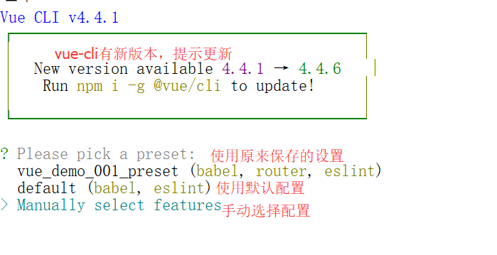
>
>##### 2.第二步 如图:
>
>​	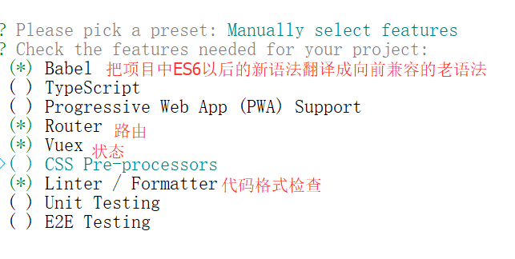 
>
>##### 3.第三步 如图:
>
>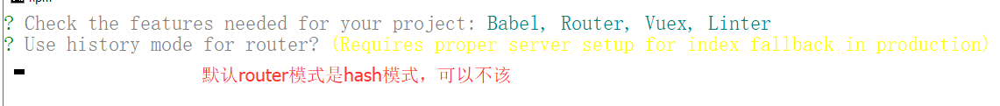
>
>##### 4.第四步 如图:
>
>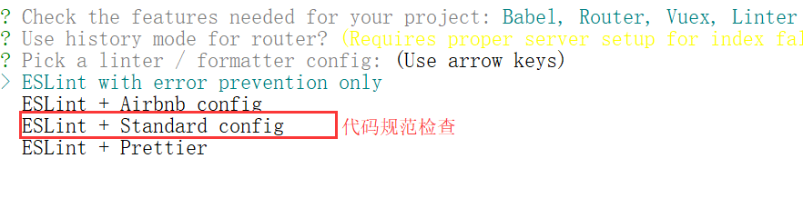
>
>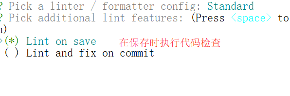
>
>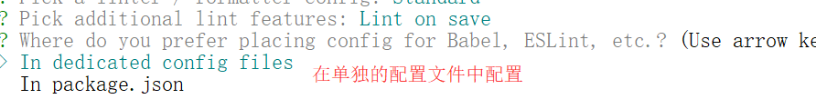

#### 4.至此，一个简单的vue项目就通过vue-cli工具创建出来了,接下来通过vscode打开工程继续开发。

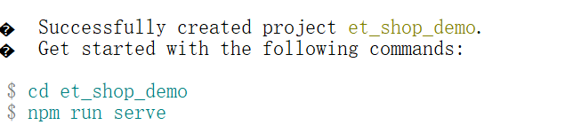

## 二、安装element-ui和axios

#### 1.安装element-ui

~~~
npm i element-ui -S  
~~~

> 注意:
>
> 1. -S:表示保存到dependencies中  -D:保存到devDependencies中
>    devDependencies  里面的插件只用于开发环境，不用于生产环境，而 dependencies  是需要发布到生产环境的
> 2. 安装完毕之后，在node_modules中多了一个elementui的文件夹，相当于我们后台工程中引入的jar包。

#### 2.安装axios

~~~
npm i axios -S
~~~

#### 3.安装less less-loader （主要用来编译CSS）

~~~
npm i less less-loader -D
~~~

别忘了安装， 安装qs 

~~~
npm i qs -S
~~~

~~~
npm i echarts@4.9.0    图标
~~~

#### 4.引入elementui的资源文件、全局的css文件、axios资源文件

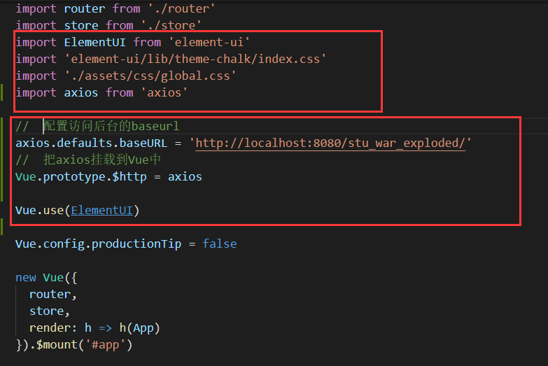

不要忘了 import  qs from 'qs'+ Vue.prototype.$qs = qs;

注意：global.css中默认为全局的样式文件，初始化可以如下：

~~~
html, body, #app {
    height: 100%;
    margin: 0;
    padding: 0;
}
~~~

#### 5.清理默认项目中

##### 5.1.App.vue清理

~~~
<template>
  

    <router-view/> <!--只需要在App.vue中放一个路由占位即可-->
  

</template>

~~~

##### 5.2.views/下的Home.vue和About.vue删掉

##### 5.3.components中新建Login.vue的组件

~~~
<template>
  
login

</template>

~~~

##### 5.4.router/下的index.js清理原来的并添加Login.vue组件的引入和路由。

~~~
import Vue from 'vue'
import VueRouter from 'vue-router'
import Login from '../components/Login.vue' 

Vue.use(VueRouter)

const routes = [
  { path: '', redirect: '/login' },
  { path: '/login', component: Login }
]
const router = new VueRouter({
  routes
})

export default router

~~~

如图:

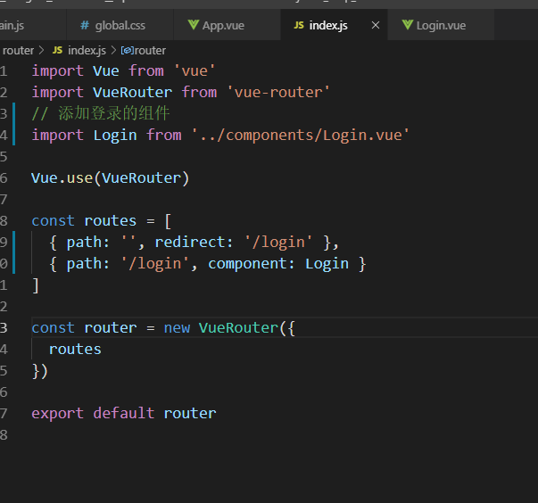

## 三、登录功能的实现

#### 1.修改Login.vue页面布局

~~~
<template>
  

    

        <h2>系统登录</h2>
      <el-form ref="loginFormRef" class="loginForm" :rules="rules" :model="loginForm" >
        <!--用户名-->
        <el-form-item  prop="username">
          <el-input v-model="loginForm.username" prefix-icon="el-icon-user"></el-input>
        </el-form-item>
        <!--密码-->
        <el-form-item prop="password">
          <el-input v-model="loginForm.password" type='password' prefix-icon='el-icon-lock' ></el-input>
        </el-form-item>
        <!--验证码-->
        <el-row :gutter="30">
            <el-col :span="10">
                <el-form-item >
                <el-input v-model="loginForm.code" placeholder="请输入验证码"  ></el-input>
                </el-form-item>
            </el-col>
            <el-col :span="14">
                <el-image  :src='verifyCode' ref='codeImage'
                @click="refresh()"
                style='width:100px;height:30px;border:1px solid #ffffff' ></el-image>
            </el-col>
        </el-row>
        <!--按钮-->
        <el-form-item class="btns">
            <el-button type="primary" @click='login()'>登录</el-button>
            <el-button type="info" @click='reset()'>重置</el-button>
         </el-form-item>
      </el-form>
    

  

</template>

~~~

### 登录页面的重点:

#### 1.页面布局 参考elementui 中表单设计

#### 2.获得验证码的流程：

总体流程:

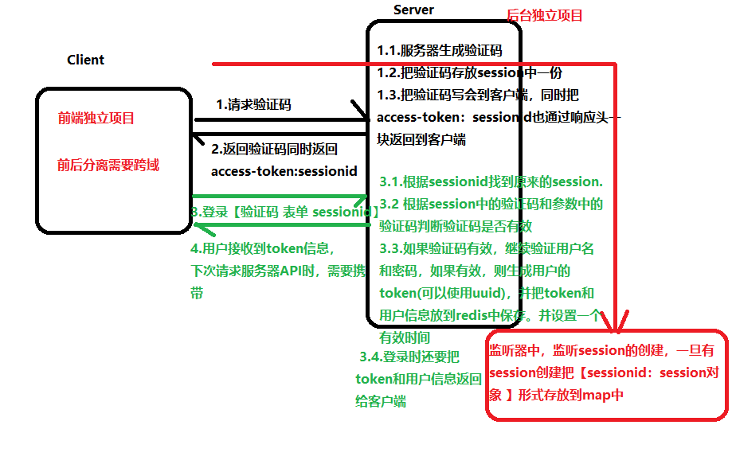

##### 	2.0、开启跨域

~~~
package com.etoak.book.filter;

import javax.servlet.*;
import javax.servlet.annotation.WebFilter;
import javax.servlet.http.HttpServletResponse;
import java.io.IOException;
@WebFilter("/*")
public class CrossFilter implements Filter {
    public CrossFilter() {
        System.out.println("Filter构造。。");
    }
    @Override
    public void init(FilterConfig filterConfig) throws ServletException {

    }

    @Override
    public void doFilter(ServletRequest req, ServletResponse response, FilterChain chain) throws IOException, ServletException {
        System.out.println("Filter过滤！！");
        HttpServletResponse httpResponse = (HttpServletResponse) response;

        // 允许所有的请求域名访问我们的跨域资源，可以固定单个或者多个内容
        httpResponse.setHeader("Access-Control-Allow-Origin", "*");//
        // httpResponse.setHeader("Access-Control-Allow-Origin", "http://localhost:9090");// 允许所有的请求域名访问我们的跨域资源，可以固定单个或者多个内容
        httpResponse.setHeader("Access-Control-Allow-Methods", "POST, GET, OPTIONS, DELETE,PUT");// 允许何种请求方法访问该跨域资源服务器
        httpResponse.setHeader("Access-Control-Max-Age", "3600");// 预检请求的有效期，单位为秒。有效期内，不会重复发送预检请求
        httpResponse.addHeader("Access-Control-Allow-Headers",
                "Accept,Origin, No-Cache, X-Requested-With, If-Modified-Since, Pragma, Last-Modified, Cache-Control, Expires, Content-Type, X-E4M-With");// 允许所有的请求header访问，可以自定义设置任意请求头信息 后期加上 authorization
        httpResponse.setHeader("Access-Control-Allow-Credentials", "true");// 是否允许用户发送、处理cookie
        //如果额外设置自己的头需要在这定义
        httpResponse.setHeader("Access-Control-Expose-Headers", "Access-Token");
        chain.doFilter(req, httpResponse);
    }

    @Override
    public void destroy() {

    }
}

~~~

##### 	2.1、首先设计一个监听器，监听session的创建，存储sessionid：session对象到集合

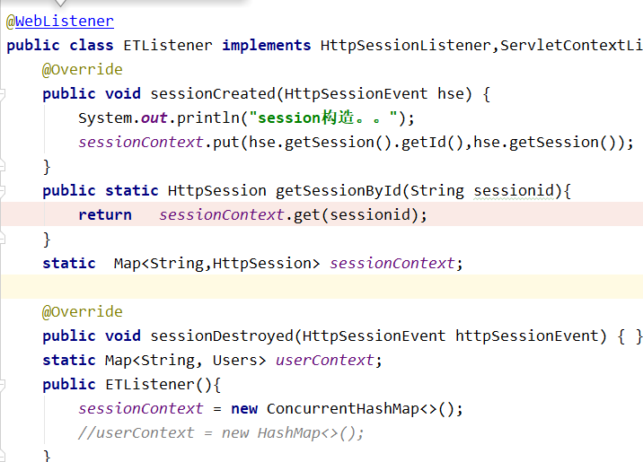

##### 	2.2、前端页面发出请求验证码请求，created中调用

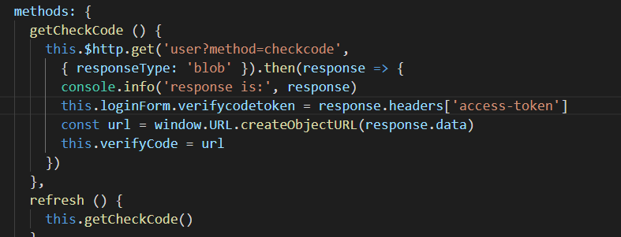

#####      2.3、后台获得验证码，把验证码放session中，并且在响应头中添加Access-Token,以session的id作为值

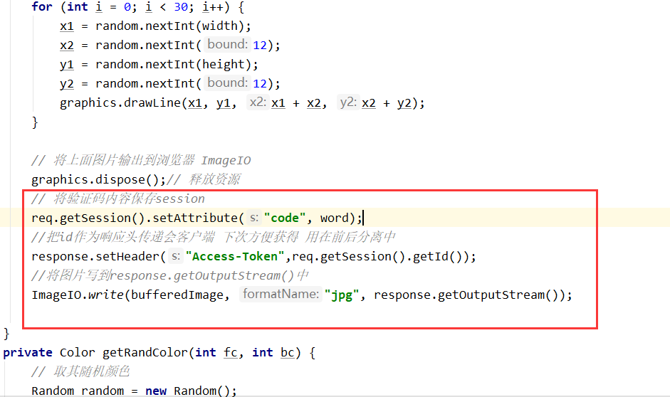

##### 2.4、在2.2中获得验证码的同时，获得verifycodetoken,其实就是从响应头中的获得Access-Token,也就是sessionid。

##### 2.5、登录时把verifycodetoken（也就是sessionid）和登录的其他信息，一块发送到服务器，服务器后台得的verifycodetoken也就是sessionid,根据这个sessionid获得2.3中放在session中的code。从而获得验证码，比较。

### 3.登录流程设计

#### 3.1、登录请求发出

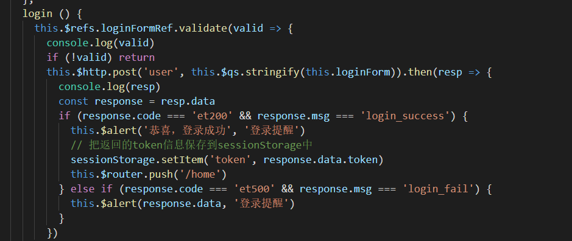

注意:需要用到qs 转换json参数成key=value形式。

#### 3.2、后台处理 

~~~
   protected void login(HttpServletRequest req, HttpServletResponse resp) throws ServletException, IOException {
        String sessionid = req.getParameter("verifycodetoken");
        String code = req.getParameter("code");
        //获得上次的session对象
        HttpSession session = ETListener.getSessionById(sessionid);
        ETJSONResponse etjsonResponse = new ETJSONResponse();
        Object obj = session.getAttribute("code");
        if(obj!=null) {
            String sessioncode = (String)obj;
            if (code != null && code.equals(sessioncode)) {
                //验证码对
                String name = req.getParameter("username");
                String pwd = req.getParameter("password");

                UserService us = new UserService();
                Users u = us.login(name,pwd);
                if(u!=null && u.getUname()!=null){
                    String token = UUID.randomUUID().toString().replaceAll("-", "");
                    u.setToken(token);

                    //登录成功！
                    etjsonResponse.setCode("et200");
                    etjsonResponse.setMsg("login_success");
                    etjsonResponse.setData(u);
                    //存放到redis
                    RedisUtil.getRedisUtil().setex(token,1800, JSONObject.toJSONString(u));

                }else{
                    //登录失败
                    etjsonResponse.setCode("et500");
                    etjsonResponse.setMsg("login_fail");
                    etjsonResponse.setData("用户名或者密码错误");

                }
            } else {
                //验证码错误
                etjsonResponse.setCode("et404");
                etjsonResponse.setMsg("check_code_error");
                etjsonResponse.setData("验证码错误");
            }
        }else{
            //验证码错误
            etjsonResponse.setCode("et404");
            etjsonResponse.setMsg("check_timeout_error");
            etjsonResponse.setMsg("验证码超时");
        }
        ETJSONUtils.writeObject(resp,etjsonResponse);
    }
~~~

## 四、后台要点

#### 4.1、前后端交互整体流程

#### 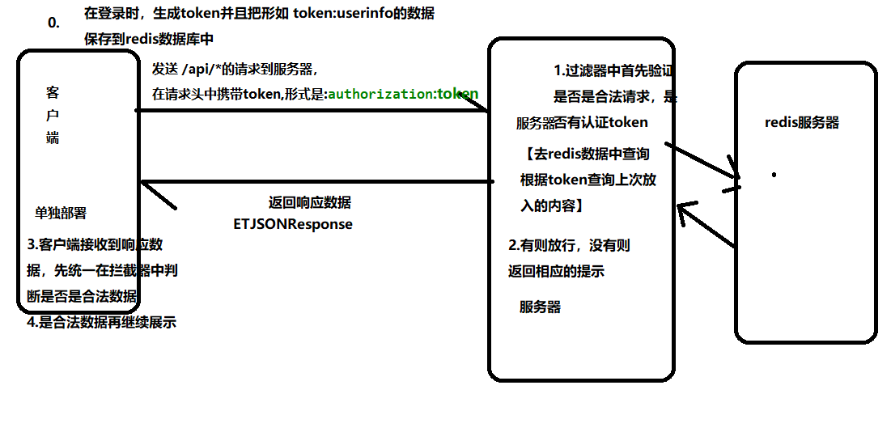4.2、后台整体流程中需要添加跨域的Filter和身份认证的Filter

  * Filter0_CrossFilter是解决跨域问题的,拦截路径 /*,即所有路径

  * Filter1_AuthorizationFilter:是身份认证问题的，拦截路径是  /api/*,也就是只验证/api/下的请求，有些请求不需要验证是否有token,如 登录、登出等

  * BookServlet("/api/book") / MenuServlet ("/api/menu")

  * 跨域Filter内容如下:

    ~~~
      HttpServletResponse httpResponse = (HttpServletResponse) response;
    
            // 允许所有的请求域名访问我们的跨域资源，可以固定单个或者多个内容
            httpResponse.setHeader("Access-Control-Allow-Origin", "*");//
            // httpResponse.setHeader("Access-Control-Allow-Origin", "http://localhost:9090");// 允许所有的请求域名访问我们的跨域资源，可以固定单个或者多个内容
            httpResponse.setHeader("Access-Control-Allow-Methods", "POST, GET, OPTIONS, DELETE,PUT");// 允许何种请求方法访问该跨域资源服务器
            httpResponse.setHeader("Access-Control-Max-Age", "3600");// 预检请求的有效期，单位为秒。有效期内，不会重复发送预检请求
            httpResponse.addHeader("Access-Control-Allow-Headers",
                    "Accept, authorization,Origin, No-Cache, X-Requested-With, If-Modified-Since, Pragma, Last-Modified, Cache-Control, Expires, Content-Type, X-E4M-With");// 允许所有的请求header访问，可以自定义设置任意请求头信息
            httpResponse.setHeader("Access-Control-Allow-Credentials", "true");// 是否允许用户发送、处理cookie
            //如果额外设置自己的头需要在这定义
            httpResponse.setHeader("Access-Control-Expose-Headers", "Access-Token");
            chain.doFilter(req, httpResponse);
    ~~~

## 五、前台要点

#### 5.1、 首页整体布局

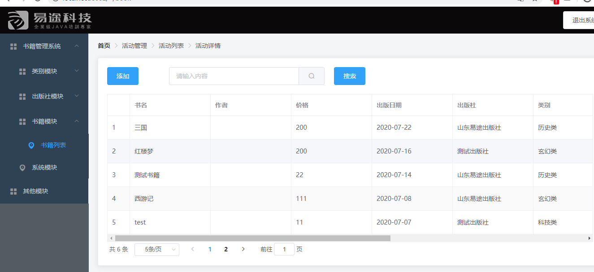

5.2、首页布局 components/home

~~~
<template>
   <el-container class="home-container">
    <el-header>
        
        <el-button>退出系统</el-button>
    </el-header>
    <el-container>
        <el-aside width="200px">
             <el-menu :default-openeds="['1', '3']">
      <el-submenu index="1">
        <template slot="title"><i class="el-icon-message"></i>导航一</template>
        <el-menu-item-group>
          <template slot="title">分组一</template>
          <el-menu-item index="1-1">选项1</el-menu-item>
          <el-menu-item index="1-2">选项2</el-menu-item>
        </el-menu-item-group>
        <el-menu-item-group title="分组2">
          <el-menu-item index="1-3">选项3</el-menu-item>
        </el-menu-item-group>
        <el-submenu index="1-4">
          <template slot="title">选项4</template>
          <el-menu-item index="1-4-1">选项4-1</el-menu-item>
        </el-submenu>
      </el-submenu>
      <el-submenu index="2">
        <template slot="title"><i class="el-icon-menu"></i>导航二</template>
        <el-menu-item-group>
          <template slot="title">分组一</template>
          <el-menu-item index="2-1">选项1</el-menu-item>
          <el-menu-item index="2-2">选项2</el-menu-item>
        </el-menu-item-group>
        <el-menu-item-group title="分组2">
          <el-menu-item index="2-3">选项3</el-menu-item>
        </el-menu-item-group>
        <el-submenu index="2-4">
          <template slot="title">选项4</template>
          <el-menu-item index="2-4-1">选项4-1</el-menu-item>
        </el-submenu>
      </el-submenu>
      <el-submenu index="3">
        <template slot="title"><i class="el-icon-setting"></i>导航三</template>
        <el-menu-item-group>
          <template slot="title">分组一</template>
          <el-menu-item index="3-1">选项1</el-menu-item>
          <el-menu-item index="3-2">选项2</el-menu-item>
        </el-menu-item-group>
        <el-menu-item-group title="分组2">
          <el-menu-item index="3-3">选项3</el-menu-item>
        </el-menu-item-group>
        <el-submenu index="3-4">
          <template slot="title">选项4</template>
          <el-menu-item index="3-4-1">选项4-1</el-menu-item>
        </el-submenu>
      </el-submenu>
    </el-menu>
        </el-aside>
        <el-main><router-view></router-view></el-main>
    </el-container>
</el-container>
</template>

~~~

5.3 router下的index.js中添加路由跳转信息

~~~
import Vue from 'vue'
import VueRouter from 'vue-router'
import Login from '../components/Login.vue'
import Home from '../components/Home.vue'
import User from '../components/user/User.vue'
Vue.use(VueRouter)

const routes = [
  {
    path: '/login',
    component: Login
  },
  {
    path: '',
    redirect: '/login'
  },
  {
    path: '/home',
    component: Home,
    children: [{ path: '/user', component: User }]
  }
]

const router = new VueRouter({
  routes
})

export default router

~~~

5.4、在component/book 新建Book.vue ,复制如下模板

~~~
<template>

 <el-breadcrumb separator-class="el-icon-arrow-right" style="margin-bottom:20px">
  <el-breadcrumb-item :to="{ path: '/' }">首页</el-breadcrumb-item>
  <el-breadcrumb-item>活动管理</el-breadcrumb-item>
  <el-breadcrumb-item>活动列表</el-breadcrumb-item>
  <el-breadcrumb-item>活动详情</el-breadcrumb-item>
</el-breadcrumb>
<el-card class="box-card">
  <el-row :gutter="20" class="search">
    <el-col :span='3'>
      <el-button @click="dialogFormVisible = true"  type='primary'>添加</el-button>
    </el-col>
    <el-col :span='8'>
      <el-input placeholder="请输入内容" >
        <el-button slot="append" icon="el-icon-search"></el-button>
      </el-input>
    </el-col>
    <el-col :span='3'>
      <el-button  @click="dialogFormVisible = true" type='primary'>搜索</el-button>
    </el-col>
  </el-row>
    <el-table :stripe="true" border :data="tableData" style="width: 100%">
        <el-table-column type="index" width="50" />
        <el-table-column prop="name"  label="书名" width="180" />
        <el-table-column prop="author" label="作者" width="180" />
        <el-table-column prop="price" label="价格" width="180" />
        <el-table-column prop="pdate" label="出版日期" width="180" />
        <el-table-column prop="pub.name" label="出版社" width="180" />
        <el-table-column prop="ca.name" label="类别" width="180" />
        <el-table-column prop="stock" label="数量" width="180" />
        <el-table-column prop="del" label="是否删除" width="180" />
        <el-table-column prop="status" label="状态" width="180" >
          <template slot-scope="scope">
        <i class="el-icon-time"></i>
        {{ scope.row.status==0?"上架":"下架" }}
      </template>
        </el-table-column>
        <el-table-column width="180">
          <template slot-scope="scope">
        <el-button
          size="mini"
          @click="handleEdit(scope.$index, scope.row)">编辑</el-button>
        <el-button
          size="mini"
          type="danger"
          @click="handleDelete(scope.$index, scope.row)">删除</el-button>
      </template>
        </el-table-column>
    </el-table>
     <el-pagination
      @size-change="handleSizeChange"
      @current-change="handleCurrentChange"
      :current-page="pageNumber"
      :page-sizes="[5, 6, 7, 8]"
      :page-size="pageSize"
      layout="total, sizes, prev, pager, next, jumper"
      :total="total">
    </el-pagination>
</el-card>

<el-dialog title="收货地址" :visible.sync="dialogFormVisible">
  <el-form :model="book">
    <el-upload
  class="upload-demo"
  action="http://localhost:8080/api/book?method=add"
  :on-preview="handlePreview"
  :on-remove="handleRemove"
  :before-remove="beforeRemove"
  :headers="uploadheader"
  multiple
  :limit="3"
  :on-exceed="handleExceed"
  :file-list="fileList">
  <el-button size="small" type="primary">点击上传</el-button>
  
只能上传jpg/png文件，且不超过500kb

</el-upload>
    <el-form-item label="书籍名称" :label-width="formLabelWidth">
      <el-input v-model="book.name" autocomplete="off"></el-input>
    </el-form-item>
    <el-form-item label="书籍作者" :label-width="formLabelWidth">
      <el-input v-model="book.author" autocomplete="off"></el-input>
    </el-form-item>
    <el-form-item label="书籍价格" :label-width="formLabelWidth">
      <el-input v-model="book.price" autocomplete="off"></el-input>
    </el-form-item>
    <el-form-item label="书籍状态" :label-width="formLabelWidth">
      <el-select v-model="book.status" placeholder="请选择活动区域">
        <el-option label="区域一" value="shanghai"></el-option>
        <el-option label="区域二" value="beijing"></el-option>
      </el-select>
    </el-form-item>
    <el-form-item label="出版社" :label-width="formLabelWidth">
      <el-select v-model="book.publisherid" placeholder="请选择出版社">
        <el-option v-for="(item,index) in pubs" :key='index' :label="item.name" :value="item.id"></el-option>
      </el-select>
    </el-form-item>
  </el-form>
  

    <el-button >取 消</el-button>
    <el-button type="primary" @click="dialogFormVisible = false">确 定</el-button>
  

</el-dialog>

</template>

~~~

